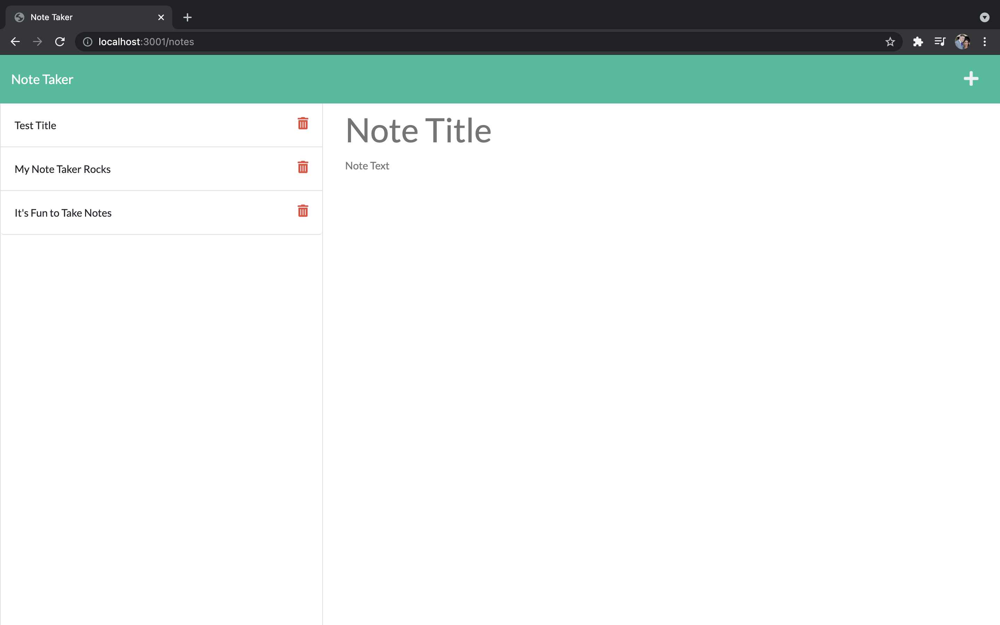

# Singapuri-Note-Taker11 Express.js: Note Taker
## Description
This Note Taker will make sure that you never again forget the many things you need to do during your busy day.

## Table of Contents 
- [Installation](#installation)
- [Usage](#usage)
- [Credits](#credits)
- [License](#license)
- [Mock-up](#Mock-up)
- [Demo](#Demo)

## Installation
- Express
- Path
- FS

## Usage
This will allow the user to input the things they need to complete using a title input and then a text area for more specific information about the task.

## Credits
John Singapuri

## Mock-Up

The following images show the web application's appearance and functionality:

## License
The last section of a high-quality README file is the license. This lets other developers know what they can and cannot do with your project. If you need help choosing a license, refer to [https://choosealicense.com/](https://choosealicense.com/)